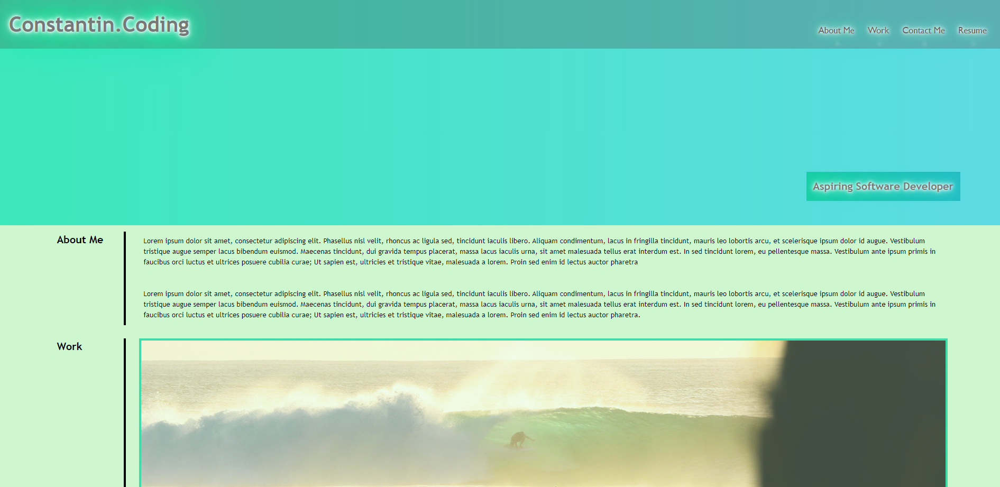

# Responsive-Portfolio
## Description
Working With CSS Challenge: Portfolio
A portfolio of work can showcase your skills and talents to employers looking to fill a part-time or full-time position. An effective portfolio highlights your strongest work as well as the thought processes behind it. Students who have portfolios with deployed web applications (meaning they are live on the web) are typically very successful in their career search after the boot camp. This last point can’t be stressed enough: having several deployed projects is a minimum requirement to receive an initial interview at many companies.

## Installation
N/A

## Usage
The following image shows the web application's appearance and functionality:

## Deployment
Live URL: https://costea47.github.io/Responsive-Portfolio/
GitHub Repository: https://github.com/Costea47/Responsive-Portfolio

## License
This project is licensed under the MIT License.